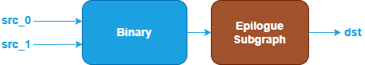

Binary Fusion Patterns {#dev_guide_graph_binary_fusion_patterns}
================================================================

## Overview

The Binary category includes operations such as: Add, Subtract, Maximum,
Minimum, Multiply, Divide.

oneDNN supports various binary fusion patterns to optimize performance and
reduce memory bandwidth requirements. This document describes the supported
fusion patterns for Binary operations.

## Pattern Structure

oneDNN defines floating-point Binary fusion patterns as follows.
The blue nodes are required when defining a Binary fusion pattern while the
brown nodes are optional.

1. **Binary Operation**: Performs the corresponding binary operation between the
   `src_0` and `src_1` tensors. Refer to the Note in
   [Fusion Patterns](graph_fusion_patterns.html).
2. **Epilogue Subgraph**: Optional and can include the following operations:
   - **Binary Operations**.
   - **Unary Operations**: Refer to the Note in
   [Fusion Patterns](graph_fusion_patterns.html).

   Combination Rules:

   

   - 0 to 4 Binary or Unary operations are supported in the epilogue subgraph.

## Data Types

oneDNN supports the following combinations of data types for src0, src1
and dst:

| src_0        | src_1         | dst          |
| :----------- | :------------ | :----------- |
| f32,bf16,f16 | f32,bf16,f16  | f32,bf16,f16 |

The definition of the data types and support status on different CPU and GPU
platforms follow the general description in the [Data Types Guide](@ref dev_guide_data_types).
