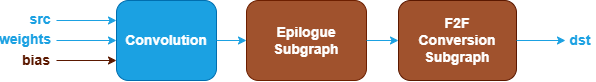
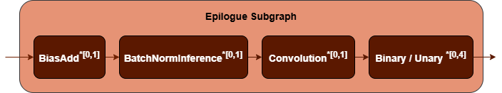

Convolution Fusion Patterns {#dev_guide_graph_convolution_fusion_patterns}
==========================================================================

## Overview

oneDNN supports both floating-point and quantized Convolution fusion patterns to
optimize performance and reduce memory bandwidth requirements. This document
describes the supported floating-point fusion patterns for Convolution. For quantized
Convolution fusion patterns, refer to
[Quantized Convolution Fusion Patterns](@ref dev_guide_graph_quantized_convolution_fusion_patterns)
for more details.

## Pattern Structure

oneDNN defines floating-point Convolution fusion patterns as follows.
The blue nodes are required when defining a Convolution fusion pattern while the
brown nodes are optional.

1. **Convolution Operation**: Performs convolution between the `src` and
   `weights` tensors. The `bias` tensor is optional. See the
   [Convolution](@ref dev_guide_op_convolution) operation in the Graph API
   for more details.
2. **Epilogue Subgraph**: Optional and can include the following operations:
   - [BiasAdd](@ref dev_guide_op_biasadd) operation.
   - [BatchNormInference](@ref dev_guide_op_batchnorminference) operation.
   - [Convolution](@ref dev_guide_op_convolution) operation.
   - Binary and Unary operations: refer to the Note in
     [Fusion Patterns](graph_fusion_patterns.html).

   Combination Rules:

   

   - **BiasAdd**: If present, must be the first op in the epilogue subgraph and
     can only appear once.
   - **BatchNormInference**: If present, must precede Binary or Unary operations
     and can only appear once.
   - **Convolution**: If present, is a Depthwise Convolution which can only be
     fused with 1x1 Convolution and can only appear once.
   - 0 to 4 Binary or Unary operations are supported in the epilogue subgraph.

3. **F2F Conversion Subgraph**: Converts the output tensor from floating-point to
   another floating-point. It is constructed by a [TypeCast](@ref dev_guide_op_typecast)
   operation.

   

## Data Types

oneDNN supports the following combinations of data types for src, weights, bias
and dst:

| src          | weights       | bias         | dst          |
| :----------- | :------------ | :----------- | :----------- |
| f32,bf16,f16 | f32,bf16,f16  | f32,bf16,f16 | f32,bf16,f16 |

The definition of the data types and support status on different CPU and GPU
platforms follow the general description in the [Data Types Guide](@ref dev_guide_data_types).

## Implementation Limitations

1. Convolution as a post op (Depthwise Convolution) is not supported on GPU.
2. Convolution and BatchNormInference cannot co-exist in the epilogue subgraph.
3. F2F Conversion Subgraph used for `dst` tensor only supports
   bf16 to f32 data type conversion.

## Example

oneDNN provides a [CPU Convolution
example](https://github.com/uxlfoundation/oneDNN/tree/main/examples/graph/cpu_getting_started.cpp)
and a [GPU Convolution example](https://github.com/uxlfoundation/oneDNN/tree/main/examples/graph/sycl_getting_started.cpp)
demonstrating how to construct a typical floating-point Convolution pattern with
oneDNN Graph API on CPU and GPU.
