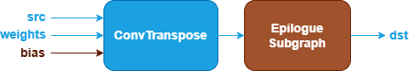

ConvTranspose Fusion Patterns {#dev_guide_graph_convtranspose_fusion_patterns}
==============================================================================

## Overview

oneDNN supports both floating-point and quantized ConvTranspose fusion patterns to
optimize performance and reduce memory bandwidth requirements. This document
describes the supported floating-point fusion patterns for ConvTranspose. For quantized
ConvTranspose fusion patterns, refer to
[Quantized ConvTranspose Fusion Patterns](@ref dev_guide_graph_quantized_convtranspose_fusion_patterns)
for more details.

## Pattern Structure

oneDNN defines floating-point ConvTranspose fusion patterns as follows.
The blue nodes are required when defining a ConvTranspose fusion pattern while the
brown nodes are optional.

1. **ConvTranspose Operation**: Performs transposed convolution between the
   `src` and `weights` tensors. The `bias` tensor is optional. See the
   [ConvTranspose](@ref dev_guide_op_convtranspose) operation in the Graph API
   for more details.
2. **Epilogue Subgraph**: Optional and can include the following operations:
   - [BiasAdd](@ref dev_guide_op_biasadd) operation.
   - Binary and Unary operations: refer to the Note in
     [Fusion Patterns](graph_fusion_patterns.html).

   Combination Rules:

   

   - **BiasAdd**: If present, must be the first op in the epilogue subgraph and
     can only appear once.
   - 0 to 4 Binary or Unary operations are supported in the epilogue subgraph.

## Data Types

oneDNN supports the following combinations of data types for src, weights, bias
and dst:

| src          | weights       | bias         | dst          |
| :----------- | :------------ | :----------- | :----------- |
| f32,bf16,f16 | f32,bf16,f16  | f32,bf16,f16 | f32,bf16,f16 |

The definition of the data types and support status on different CPU and GPU
platforms follow the general description in the [Data Types Guide](@ref dev_guide_data_types).
