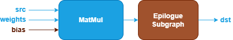

MatMul Fusion Patterns {#dev_guide_graph_matmul_fusion_patterns}
================================================================

## Overview

oneDNN supports both floating-point and quantized MatMul fusion patterns to
optimize performance and reduce memory bandwidth requirements. This document
describes the supported floating-point fusion patterns for MatMul. For quantized
MatMul fusion patterns, refer to [Quantized MatMul Fusion Patterns](@ref dev_guide_graph_quantized_matmul_fusion_patterns)
for more details.

## Pattern Structure

oneDNN defines floating-point MatMul fusion patterns as follows.
The blue nodes are required when defining a MatMul fusion pattern while the brown
nodes are optional.

1. **MatMul Operation**: Performs matrix multiplication between the `src` and
   `weights` tensors. The `bias` tensor is optional. See the [MatMul](@ref dev_guide_op_matmul)
   operation in the Graph API for more details.
2. **Epilogue Subgraph**: Optional and can include the following operations:
   - [BiasAdd](@ref dev_guide_op_biasadd) operation.
   - Binary and Unary operations: refer to the Note in
     [Fusion Patterns](graph_fusion_patterns.html).
   - [Select](@ref dev_guide_op_select) operation.

   Combination Rules:

   

   - **BiasAdd**: If present, must be the first op in the epilogue subgraph and
     can only appear once.
   - 0 to 4 Binary or Unary operations are supported in the epilogue subgraph.
   - **Select**: If present, must follow binary/unary operations (if present)
     and can only appear once.

## Data Types

oneDNN supports the following combinations of data types for src, weights, bias
and dst:

| src          | weights       | bias         | dst          |
| :----------- | :------------ | :----------- | :----------- |
| f32,bf16,f16 | f32,bf16,f16  | f32,bf16,f16 | f32,bf16,f16 |

The definition of the data types and support status on different CPU and GPU
platforms follow the general description in the [Data Types Guide](@ref dev_guide_data_types).

## Example

oneDNN provides a [CPU MatMul
example](https://github.com/uxlfoundation/oneDNN/tree/main/examples/graph/cpu_simple_op_partition.cpp)
and a [GPU MatMul example](https://github.com/uxlfoundation/oneDNN/tree/main/examples/graph/sycl_simple_op_partition.cpp)
demonstrating how to construct a typical floating-point MatMul pattern
with oneDNN Graph API on CPU and GPU.