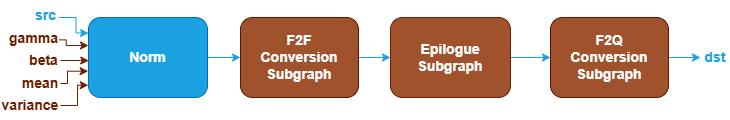
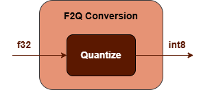

Norm Fusion Patterns {#dev_guide_graph_norm_fusion_patterns}
============================================================

## Overview

The Norm category for inference includes operations such as:
GroupNorm, LayerNorm and BatchNormInference.

oneDNN supports various Norm fusion patterns to optimize performance and
reduce memory bandwidth requirements. This document describes the supported
fusion patterns for Norm.

## Pattern Structure

oneDNN defines floating-point Norm fusion patterns as follows.
The blue nodes are required when defining a Norm fusion pattern while the
brown nodes are optional.

1. **Norm Operation**: Performs the corresponding norm operation for the `src`
   tensor. See the [GroupNorm](@ref dev_guide_op_groupnorm),
   [LayerNorm](@ref dev_guide_op_layernorm), [BatchNormInference](@ref dev_guide_op_batchnorminference)
   operations in the Graph API for more details.
2. **F2F Conversion Subgraph**: Converts the output tensor from floating-point to
   another floating-point. It is constructed by a [TypeCast](@ref dev_guide_op_typecast)
   operation.

   

3. **Epilogue Subgraph**: Optional and can include the following operations:
   - Binary and Unary operations: refer to the Note in
     [Fusion Patterns](graph_fusion_patterns.html).

   Combination Rules:

   

   - 0 to 4 Binary or Unary operations are supported in the epilogue subgraph.

4. **F2Q Conversion Subgraph**: Converts the output
   tensor from floating-point to quantized data type. It can
   be one of the following subgraphs. It is constructed by a
   [Quantize](@ref dev_guide_op_quantize) operation.

   

## Data Types

oneDNN supports the following combinations of data types for src and dst:

| src           | dst                |
| :------------ | :----------------- |
| bf16,f16,f32  | u8,s8,bf16,f16,f32 |

The definition of data types and their support status on different CPU and GPU
platforms follow the general description in the [Data Types Guide](@ref dev_guide_data_types).

## Implementation Limitations

1. BatchNormInference:
   1. The Epilogue Subgraph only supports ReLU, and if present, can only appear once.
   2. F2F and F2Q Conversion Subgraphs are not supported.
