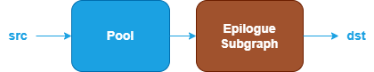

Pool Fusion Patterns {#dev_guide_graph_pool_fusion_patterns}
============================================================

## Overview

The Pool category includes operations such as: AvgPool and MaxPool.

oneDNN supports various pool fusion patterns to optimize performance and
reduce memory bandwidth requirements. This document describes the supported
fusion patterns for Pool operations.

## Pattern Structure

oneDNN defines floating-point Pool fusion patterns as follows.
The blue nodes are required when defining a Pool fusion pattern while the
brown nodes are optional.

1. **Pool Operation**: Performs the corresponding pool operation for the
   `src` tensor. See the [AvgPool](@ref dev_guide_op_avgpool)
   and [MaxPool](@ref dev_guide_op_maxpool) operations in the Graph API for more
   details.
2. **Epilogue Subgraph**: Optional and can include the following operations:
   - Binary and Unary operations: refer to the Note in
     [Fusion Patterns](graph_fusion_patterns.html).

   Combination Rules:

   

   - 0 to 4 Binary or Unary operations are supported in the epilogue subgraph.

## Data Types

oneDNN supports the following combinations of data types for src and dst:

| src          | dst          |
| :----------- | :----------- |
| f32,bf16,f16 | f32,bf16,f16 |

The definition of the data types and support status on different CPU and GPU
platforms follow the general description in the [Data Types Guide](@ref dev_guide_data_types).

## Implementation Limitations

1. The AvgPool operation doesn't support the combination of rounding_type equal
   to ceil and exclude_pad equal to false.
