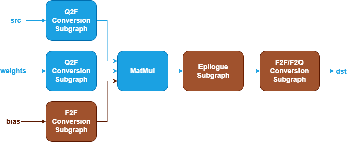
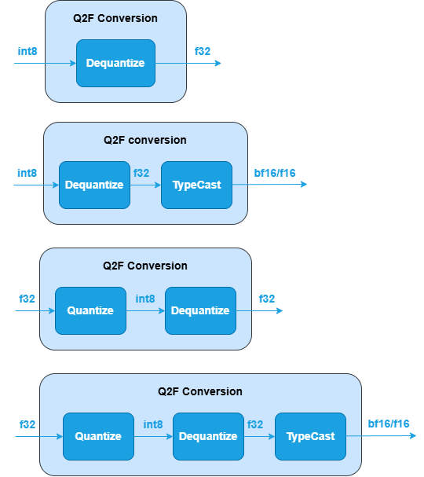
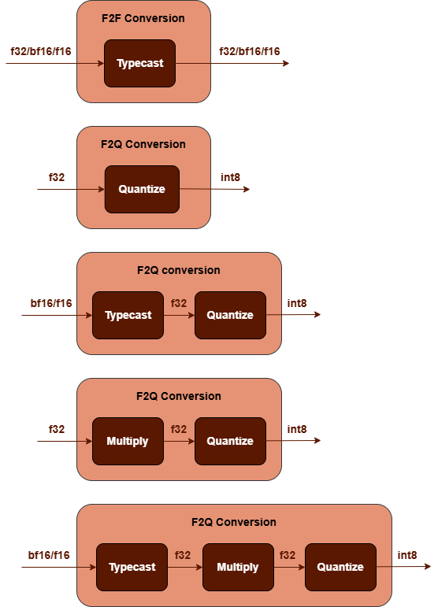

Quantized MatMul Fusion Patterns {#dev_guide_graph_quantized_matmul_fusion_patterns}
====================================================================================

## Overview

oneDNN supports both floating-point and quantized MatMul fusion patterns to
optimize performance and reduce memory bandwidth requirements. This document
describes the supported quantized fusion patterns for MatMul. For floating-point
MatMul fusion patterns, refer to [MatMul Fusion Patterns](@ref dev_guide_graph_matmul_fusion_patterns)
for more details.

## Pattern Structure

oneDNN defines quantized MatMul fusion patterns as follows.
The blue nodes are required when defining a quantized MatMul fusion pattern
while the brown nodes are optional.

1. **Q2F Conversion Subgraph**: Converts `src` and `weights` tensors
   from quantized to floating-point. It can be one of the following
   subgraphs, while the last two subgraphs apply only to `weights`.
   See [Dequantize](@ref dev_guide_op_dequantize), [TypeCast](@ref dev_guide_op_typecast)
   and [Quantize](@ref dev_guide_op_quantize)
   operations in Graph API.

   

2. **F2F Conversion Subgraph**: Converts `bias` tensor from floating-point to
   another floating-point. It is constructed by a [TypeCast](@ref dev_guide_op_typecast)
   operation.

   

3. **MatMul Operation**: Performs matrix multiplication between the `src` and
   `weights` tensors. The `bias` tensor is optional. See the [MatMul](@ref dev_guide_op_matmul)
   operation in the Graph API for more details.
4. **Epilogue Subgraph**: Optional and can include the following operations:
   - [BiasAdd](@ref dev_guide_op_biasadd) operation.
   - Binary and Unary operations: refer to the Note in
     [Fusion Patterns](graph_fusion_patterns.html).
   - [Select](@ref dev_guide_op_select) operation.

   Combination rules:

   

   - **BiasAdd**: If present, must be the first op in the epilogue subgraph and
     can only appear once.
   - 0 to 4 Binary or Unary operations are supported in the epilogue subgraph.
   - **Select**: If present, must follow binary/unary operations (if present)
     and can only appear once.

5. **F2F/F2Q Conversion Subgraph**: Converts the output
   tensor from floating-point to floating-point or quantized data type. It can
   be one of the following subgraphs, the last two subgraphs are implementations
   for SmoothQuant[1]. See [TypeCast](@ref dev_guide_op_typecast),
   [Quantize](@ref dev_guide_op_quantize) and [Multiply](@ref dev_guide_op_multiply)
   operations in Graph API.

   

## Data Types

oneDNN supports the following combinations of data types for src, weights, bias
and dst:

| src   | weights | bias         | dst                |
| :---- | :------ | :----------- | :----------------- |
| u8,s8 | s8,f32  | f32,bf16,f16 | u8,s8,bf16,f16,f32 |

The definition of the data types and support status on different CPU and GPU
platforms follow the general description in the [Data Types Guide](@ref dev_guide_data_types).

## Limitations

- F2F Conversion Subgraph used for `bias` tensor only supports f32 to bf16 data
  type conversion.

## Reference

[1] SmoothQuant, https://arxiv.org/abs/2211.10438
