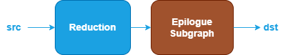

Reduction Fusion Patterns {#dev_guide_graph_reduction_fusion_patterns}
======================================================================

## Overview

The Reduction category includes operations such as: ReduceL1, ReduceL2,
ReduceMax, ReduceMean, ReduceMin, ReduceProd, ReduceSum.

oneDNN supports various reduction fusion patterns to optimize performance and
reduce memory bandwidth requirements. This document describes the supported
fusion patterns for Reduction.

## Pattern Structure

oneDNN defines floating-point Reduction fusion patterns as follows.
The blue nodes are required when defining a Reduction fusion pattern while the
brown nodes are optional.

1. **Reduction Operation**: Performs the corresponding reduction operation for the
   `src` tensor. See the [ReduceL1](@ref dev_guide_op_reducel1),
   [ReduceL2](@ref dev_guide_op_reducel2), [ReduceMax](@ref dev_guide_op_reducemax),
   [ReduceMean](@ref dev_guide_op_reducemean), [ReduceMin](@ref dev_guide_op_reducemin),
   [ReduceProd](@ref dev_guide_op_reduceprod) and
   [ReduceSum](@ref dev_guide_op_reducesum) operations in the Graph API for more
   details.
2. **Epilogue Subgraph**: Optional and can include the following operations:
   - Binary and Unary operations: refer to the Note in
     [Fusion Patterns](graph_fusion_patterns.html).

   Combination Rules:

   

   - 0 to 4 Binary or Unary operations are supported in the epilogue subgraph.

## Data Types

oneDNN supports the following combinations of data types for src and dst:

| src          | dst          |
| :----------- | :----------- |
| f32,bf16,f16 | f32,bf16,f16 |

The definition of the data types and support status on different CPU and GPU
platforms follow the general description in the [Data Types Guide](@ref dev_guide_data_types).
