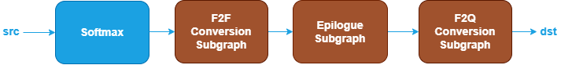
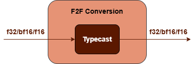
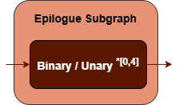
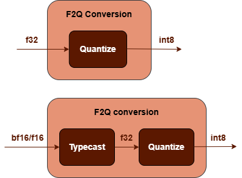

Softmax Fusion Patterns {#dev_guide_graph_softmax_fusion_patterns}
==================================================================

## Overview

oneDNN supports various SoftMax fusion patterns to optimize performance and
reduce memory bandwidth requirements. This document describes the supported
fusion patterns for SoftMax.

## Pattern Structure

oneDNN defines floating-point SoftMax fusion patterns as follows.
The blue nodes are required when defining a SoftMax fusion pattern while the
brown nodes are optional.

1. **SoftMax Operation**: Performs the softmax function for the `src` tensor. See
   the [SoftMax](@ref dev_guide_op_softmax) operation in the Graph API for more
   details.
2. **F2F Conversion Subgraph**: Converts the output tensor from floating-point to
   another floating-point. It is constructed by a [TypeCast](@ref dev_guide_op_typecast)
   operation.

   

3. **Epilogue Subgraph**: Optional and can include the following operations:
   - Binary and Unary operations: refer to the Note in
     [Fusion Patterns](graph_fusion_patterns.html).

   Combination Rules:

   

   - 0 to 4 Binary or Unary operations are supported in the epilogue subgraph.

4. **F2Q Conversion Subgraph**: Converts the output
   tensor from floating-point to quantized data type. It can be one of
   the following subgraphs. See [TypeCast](@ref dev_guide_op_typecast)
   and [Quantize](@ref dev_guide_op_quantize) operations in Graph API.

   

## Data Types

oneDNN supports the following combinations of data types for src and dst:

| src           | dst             |
| :------------ | :----------------- |
| bf16,f16,f32  | u8,s8,bf16,f16,f32 |

The definition of data types and their support status on different CPU and GPU
platforms follow the general description in the [Data Types Guide](@ref dev_guide_data_types).
