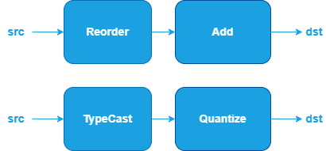

Fusion Patterns
###############

.. default-role:: math
.. toctree::
   :maxdepth: 1
   :hidden:

   dev_guide_graph_gated_mlp
   dev_guide_graph_gqa
   dev_guide_graph_sdpa_compressed_kv
   dev_guide_graph_sdpa
   MatMul <dev_guide_graph_matmul_fusion_patterns>
   Quantized MatMul <dev_guide_graph_quantized_matmul_fusion_patterns>
   Convolution <dev_guide_graph_convolution_fusion_patterns>
   Quantized Convolution <dev_guide_graph_quantized_convolution_fusion_patterns>
   ConvTranspose <dev_guide_graph_convtranspose_fusion_patterns>
   Quantized ConvTranspose <dev_guide_graph_quantized_convtranspose_fusion_patterns>
   Binary <dev_guide_graph_binary_fusion_patterns>
   Unary <dev_guide_graph_unary_fusion_patterns>
   Interpolate <dev_guide_graph_interpolate_fusion_patterns>
   Reduction <dev_guide_graph_reduction_fusion_patterns>
   Pool <dev_guide_graph_pool_fusion_patterns>
   Norm <dev_guide_graph_norm_fusion_patterns>
   SoftMax <dev_guide_graph_softmax_fusion_patterns>

The following fusion patterns represent subgraphs that the oneDNN Graph API
identifies as candidates for partitions. You can define computation graphs
according to these patterns, get partitions from the graph, compile the
partitions into compiled partitions, and execute them to obtain results. See
`Graph API Basic Concepts <dev_guide_graph_basic_concepts.html>`_ for more
details about the programming model.

.. note::
  The following categories will be used in describing a fusion pattern:

  - Binary Operations: `Add <dev_guide_op_add.html>`_,
    `Subtract <dev_guide_op_subtract.html>`_, `Maximum <dev_guide_op_maximum.html>`_,
    `Minimum <dev_guide_op_minimum.html>`_, `Multiply <dev_guide_op_multiply.html>`_,
    `Divide <dev_guide_op_divide.html>`_.
  - Unary Operations: `Abs <dev_guide_op_abs.html>`_,
    `Clamp <dev_guide_op_clamp.html>`_, `Elu <dev_guide_op_elu.html>`_,
    `Exp <dev_guide_op_exp.html>`_, `GELU <dev_guide_op_gelu.html>`_,
    `HardSigmoid <dev_guide_op_hardsigmoid.html>`_, `HardSwish <dev_guide_op_hardswish.html>`_,
    `LeakyReLU <dev_guide_op_leakyrelu.html>`_, `Log <dev_guide_op_log.html>`_,
    `Mish <dev_guide_op_mish.html>`_, `Sigmoid <dev_guide_op_sigmoid.html>`_,
    `SoftPlus <dev_guide_op_softplus.html>`_, `ReLU <dev_guide_op_relu.html>`_,
    `Round <dev_guide_op_round.html>`_, `Sqrt <dev_guide_op_sqrt.html>`_,
    `Square <dev_guide_op_square.html>`_, `Tanh <dev_guide_op_tanh.html>`_.

.. list-table:: 
   :widths: 30 70
   :header-rows: 1

   * - Pattern
     - Description
   * - Scaled Dot-Product Attention
     - This pattern is widely used for attention mechanisms in transformer models, e.g., BERT and GPT. Refer to `Scaled Dot-Product Attention (SDPA) <dev_guide_graph_sdpa.html>`_ for more details.
   * - Grouped Query Attention
     - This pattern is widely in LLM models like llama2 70b and llama3 to reduce the memory usage of the kv cache during inference. Refer to `Grouped Query Attention (GQA) <dev_guide_graph_gqa.html>`_ for more details.
   * - Scaled Dot-Product Attention with Compressed Key/Value
     - This pattern is used for memory-efficient attention mechanisms. Refer to `Scaled Dot-Product Attention with Compressed Key/Value <dev_guide_graph_sdpa_compressed_kv.html>`_ for more details.
   * - Gated Multi-Layer Perceptron (Gated-MLP)
     - This pattern is widely used for enhancing feedforward layers in transformer models, e.g., Vision Transformers (ViT). Refer to `Gated Multi-Layer Perceptron (Gated-MLP) <dev_guide_graph_gated_mlp.html>`_ for more details.
   * - MatMul Fusion Patterns
     - This pattern is widely used in language models and recommendation models, for example BERT, DLRM, etc. Refer to `MatMul Fusion Patterns <dev_guide_graph_matmul_fusion_patterns.html>`_ for more details.
   * - Quantized MatMul Fusion Patterns
     - This pattern is widely used for efficient matrix multiplication in quantized models. Refer to `Quantized MatMul Fusion Patterns <dev_guide_graph_quantized_matmul_fusion_patterns.html>`_ for more details.
   * - Convolution Fusion Patterns
     - This pattern is widely used in Convolution Neural Networks, e.g., ResNet, ResNext, SSD, etc. Refer to `Convolution Fusion Patterns <dev_guide_graph_convolution_fusion_patterns.html>`_ for more details.
   * - Quantized Convolution Fusion Patterns
     - This pattern is widely used in quantized Convolution Neural Networks. Refer to `Quantized Convolution Fusion Patterns <dev_guide_graph_quantized_convolution_fusion_patterns.html>`_ for more details.
   * - ConvTranspose Fusion Patterns
     - This pattern is widely used for upsampling in Generative Adversarial Networks. Refer to `ConvTranspose Fusion Patterns <dev_guide_graph_convtranspose_fusion_patterns.html>`_ for more details.
   * - Quantized ConvTranspose Fusion Patterns
     - This pattern is widely used in quantized Generative Adversarial Networks. Refer to `Quantized ConvTranspose Fusion Patterns <dev_guide_graph_quantized_convtranspose_fusion_patterns.html>`_ for more details.
   * - Binary Fusion Patterns
     - Fusion Patterns related to binary operations (refer to above Note for more details). This pattern is widely used in language models and recommendation models, e.g., BERT, DLRM. Refer to `Binary Fusion Patterns <dev_guide_graph_binary_fusion_patterns.html>`_ for more details.
   * - Unary Fusion Patterns
     - Fusion Patterns related to unary operations (refer to above Note for more details). This pattern is widely used in Convolution Neural Networks. Refer to `Unary Fusion Patterns <dev_guide_graph_unary_fusion_patterns.html>`_ for more details.
   * - Interpolate Fusion Patterns
     - This pattern is widely used for image processing. Refer to `Interpolate Fusion Patterns <dev_guide_graph_interpolate_fusion_patterns.html>`_ for more details.
   * - Reduction Fusion Patterns
     - Fusion Patterns related to reduction operations like ReduceL1, ReduceL2, ReduceMax, ReduceMean, ReduceMin, ReduceProd, ReduceSum. This pattern is widely used for data processing, for example loss reduction. Refer to `Reduction Fusion Patterns <dev_guide_graph_reduction_fusion_patterns.html>`_ for more details.
   * - Pool Fusion Patterns
     - Fusion Patterns related to pool operations like MaxPool, AvgPool. This pattern is widely used in Convolution Neural Networks. Refer to `Pool Fusion Patterns <dev_guide_graph_pool_fusion_patterns.html>`_ for more details.
   * - Norm Fusion Patterns
     - Fusion Patterns related to norm operations like GroupNorm, LayerNorm, BatchNormInference. This pattern is widely used in Convolution Neural Networks, for example DenseNet. Refer to `Norm Fusion Patterns <dev_guide_graph_norm_fusion_patterns.html>`_ for more details.
   * - SoftMax Fusion Patterns
     - This pattern is widely used in Convolution Neural Networks. Refer to `SoftMax Fusion Patterns <dev_guide_graph_softmax_fusion_patterns.html>`_ for more details.
   * - Other Fusion Patterns
     - Refer to the below section for more details.

Other Fusion Patterns
^^^^^^^^^^^^^^^^^^^^^

The Other category currently includes operations such as:
`Reorder <dev_guide_op_reorder.html>`_, `TypeCast <dev_guide_op_typecast.html>`_,
and `Quantize <dev_guide_op_quantize.html>`_.

oneDNN supports specialized fusion patterns for Other operations to
optimize performance and reduce memory bandwidth requirements.

Pattern Structure:

